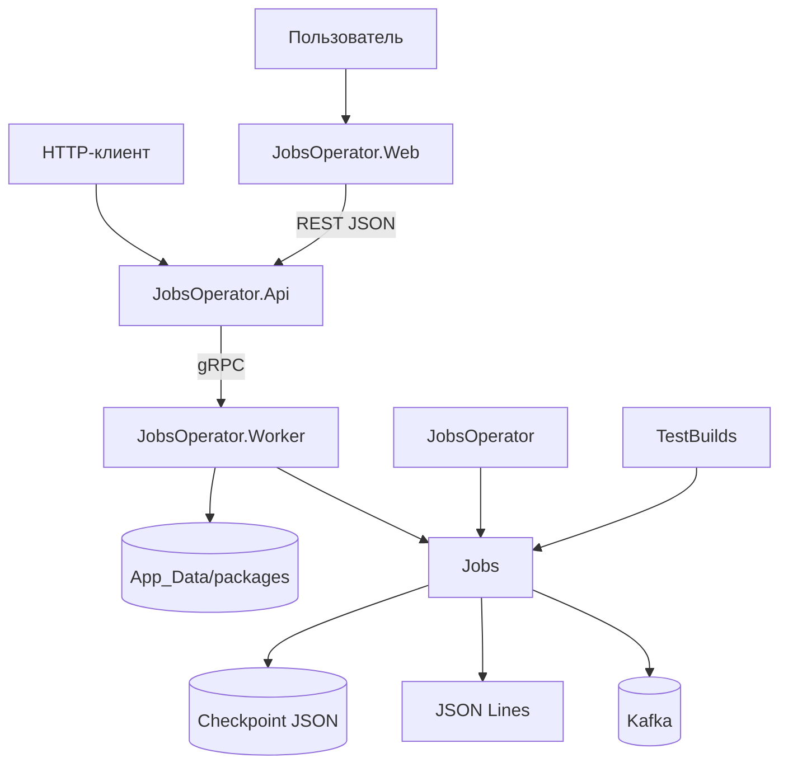
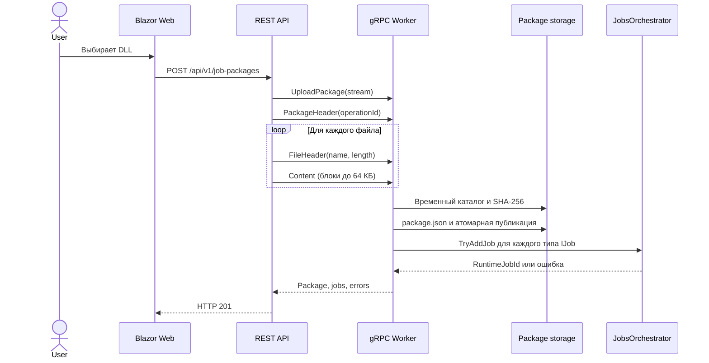

# Архитектура

## Назначение системы

JobsOperator отделяет описание потокового задания от его запуска и управления. Пользовательская сборка содержит один или несколько типов `IJob`; ядро строит для каждого типа исполняемый граф, а Operator stack принимает DLL, запускает задания в Worker и показывает диагностику через Web UI.

## Контекст компонентов

## Проекты и зависимости

| Проект | Тип | Прямые зависимости | Ответственность |
|---|---|---|---|
| `Jobs` | class library | Confluent.Kafka | Публичный DSL, выполнение, checkpoints, состояния, встроенные Kafka/JSON компоненты |
| `TestBuilds` | class library | `Jobs` | Демонстрационные реализации `IJob` |
| `JobsOperator` | console app | `Jobs`, `TestBuilds` | Прямой запуск `SampleJob` или `KafkaRelayJob` |
| `JobsOperator.Protos` | class library | Google.Protobuf, gRPC API/Tools | Генерация gRPC client/server типов из `job.proto` |
| `JobsOperator.Worker` | ASP.NET Core gRPC app | `Jobs`, `JobsOperator.Protos` | Пакеты DLL, карточки заданий, попытки выполнения |
| `JobsOperator.Api` | ASP.NET Core Web API | `JobsOperator.Protos` | REST façade и потоковый gRPC-клиент Worker |
| `JobsOperator.Web` | Blazor Web App | REST API | Интерактивный серверный UI и опрос состояния |

Зависимости направлены внутрь: Worker знает ядро, API знает только gRPC-контракт, Web UI знает только REST-модели. Бизнес-исполнение не находится в HTTP-контроллере или Razor-компоненте.

## Поток загрузки пакета

API и Worker повторяют проверки имени, расширения, количества и размера файлов. Worker сначала пишет пакет во временный каталог `.uploads`, а после полной проверки переносит каталог в окончательное расположение. Опубликованный пакет сохраняется даже тогда, когда ни один тип задания не удалось запустить.

## Модель идентификаторов

Система различает три идентификатора:

| Поле | Срок жизни | Назначение |
|---|---|---|
| `PackageId` | опубликованный набор DLL | Имя каталога пакета и идентификатор результата загрузки |
| `JobId` | карточка в памяти Worker | Стабильный адрес команд start/stop/delete |
| `RuntimeJobId` | одна попытка в `JobsOrchestrator` | Диагностика и отмена конкретного запуска |

При первой загрузке `JobId` совпадает с первым `RuntimeJobId`. После повторного запуска `JobId` остается прежним, а `RuntimeJobId` меняется. После успешной остановки `RuntimeJobId` становится `null`.

## Поток исполнения одного конвейера

Для каждого полностью описанного pipeline создается отдельный `PipelineRunner<TInput,TOutput>`. Он использует одного producer и одного consumer. Канал ограничен 128 элементами и создает backpressure: источник ждет, когда обработчик освободит место.

Несколько pipeline одного задания работают конкурентно. Внутри одного pipeline обработка последовательная и сохраняет порядок чтения.

## Checkpoint barrier

Координатор срабатывает по `PeriodicTimer`:

1. блокирует прием новых записей во всех pipeline
2. ждет обработки всех записей, уже принятых в каналы
3. получает позицию следующего чтения каждого источника
4. получает снимки всех состояний
5. записывает единый временный JSON-файл
6. заменяет целевой файл и возобновляет pipeline

Таким образом, позиции источников и `IState<T>` фиксируются на одной логической границе. Встроенный Kafka source не коммитит offsets в Kafka: источником истины служит checkpoint фреймворка.

## Operator stack

### Worker

Worker — единственный процесс Operator stack, который загружает и выполняет пользовательский код. Он хранит:

- опубликованные DLL и `package.json` на диске
- карточки заданий в `ConcurrentDictionary`
- попытки выполнения в singleton `JobsOrchestrator`

### API

API не выполняет задания и не хранит их состояние. Каждый REST-запрос преобразуется в gRPC-вызов Worker. Поэтому перезапуск API не прерывает работающие задания.

### Web

Web — Blazor Web App с interactive server render mode. `JobsApiClient` зарегистрирован через `IHttpClientFactory`. Главная страница раз в секунду получает полный список карточек и отображает команды, диагностику и до 50 элементов каждого состояния.

## Границы отказа

- ошибка одного pipeline отменяет остальные pipeline того же задания
- неожиданное завершение checkpoint coordinator отменяет все pipeline задания
- ошибка одной реализации `IJob` при загрузке пакета не останавливает другие успешно запущенные реализации
- остановка Worker завершает все выполняемые задания и теряет каталог карточек в памяти
- остановка API или Web UI не останавливает Worker
- пакет DLL и checkpoints переживают перезапуск процесса, если их каталоги сохранены

## Смежные документы

- [Разработка заданий](job-development.md)
- [Runtime и checkpoints](runtime-and-checkpoints.md)
- [Operator stack](operator-stack.md)
- [Эксплуатация и ограничения](operations-and-limitations.md)
