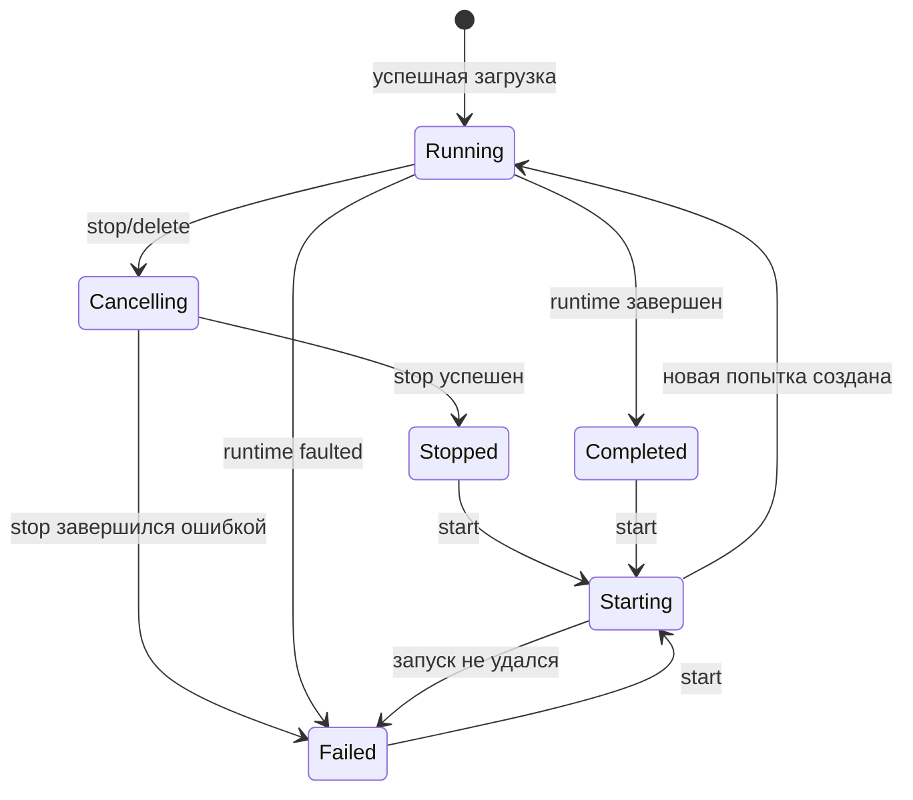

# Operator stack

Operator stack состоит из трех ASP.NET Core приложений: gRPC Worker, REST API и Blazor Web App.

## JobsOperator.Worker

Worker регистрирует singleton-компоненты:

| Сервис | Назначение |
|---|---|
| `JobsOrchestrator` | Запускает и отменяет конкретные попытки выполнения |
| `JobPackageStorage` | Принимает, проверяет и публикует пакеты DLL |
| `WorkerJobManager` | Хранит карточки, загружает типы и управляет start/stop/delete |
| `JobService` | Реализует gRPC-контракт |

Kestrel по умолчанию настроен на HTTP/2 для всех endpoints. Корневой GET endpoint возвращает справочный текст; команды выполняются через gRPC.

### Публикация пакета

Пакет записывается в:

```text
<JobPackages:Path>/<PackageId N>/
  MyJobs.dll
  Dependency.dll
  package.json
```

Во время загрузки используется соседний каталог `.uploads/<id>.<random>.tmp`. При отмене или ошибке временный каталог удаляется. Для каждого файла вычисляется SHA-256, который сохраняется в manifest и возвращается клиенту.

Проверки Worker:

- идентификатор операции — непустой GUID
- package header передается ровно один раз и до файлов
- до 20 файлов
- только непустые `.dll`
- имена без элементов пути и повторов без учета регистра
- объявленная длина совпадает с фактической
- общий размер не более 100 МБ

### Загрузка сборок

`WorkerJobManager` создает отдельный `AssemblyLoadContext` для пакета. Это обычный, не collectible context. Зависимость ищется как `<AssemblyName>.dll` в каталоге пакета. Запрос сборки `Jobs` всегда разрешается на контракт Worker.

Worker пытается загрузить каждый DLL-файл, кроме `Jobs.dll`, затем ищет все конкретные типы `IJob`. Ошибки отдельных файлов и типов накапливаются в результате. Каждый подходящий тип создается через публичный parameterless constructor и передается в `JobsOrchestrator`.

### Карточка задания

Карточка содержит тип, сборку, стабильный `JobId`, текущий `RuntimeJobId`, время последнего запуска, состояние и последний известный snapshot.



Команды для одной карточки сериализуются через `SemaphoreSlim`. Это предотвращает одновременный start/stop/delete одной и той же карточки.

Особенности:

- stop разрешен только в `Running`
- start запрещен в `Running`, `Starting` и `Cancelling`
- повторный start создает новый экземпляр типа и новый runtime ID
- delete останавливает активную попытку и удаляет карточку
- delete не удаляет опубликованный каталог пакета

## JobsOperator.Api

API использует современную модель ASP.NET Core:

- controllers и endpoint routing
- `ProblemDetails`
- строковая сериализация enums
- typed gRPC client через DI
- OpenAPI и Swagger UI только в Development

Контроллер не хранит карточки. Для каждой операции он вызывает Worker и преобразует gRPC status в HTTP status. Поток загрузки читается из multipart и пересылается Worker блоками до 64 КБ, без накопления всего файла в одном `byte[]`.

Подробный контракт: [REST API](rest-api.md).

## JobsOperator.Web

Web UI — Blazor Web App с interactive server rendering. Компоненты выполняются на сервере, а браузер поддерживает интерактивную сессию Blazor.

`JobsApiClient`:

- использует base address из `JobsApi:BaseAddress`
- имеет HTTP timeout 10 минут
- проверяет расширение, число, размер и повтор имен до отправки
- преобразует `ProblemDetails` в пользовательскую `JobsApiException`

Главная страница:

- загружает начальный список заданий
- обновляет его раз в секунду
- показывает общее число, активные задания, счетчик и последнюю активность
- отображает тип, сборку, статус, последнее сообщение и ошибку
- показывает до 50 элементов каждого `IState<T>`
- разрешает upload, stop, restart и delete

UI не обращается к Worker напрямую.

## Жизненный цикл и перезапуски

| Событие | Результат |
|---|---|
| Перезапуск Web | задания продолжаются; UI перечитает карточки из API |
| Перезапуск API | задания продолжаются; после восстановления gRPC связи карточки снова доступны |
| Перезапуск Worker | все попытки прекращаются; карточки в памяти теряются |
| Сохраненный package directory после restart Worker | DLL остаются, но автоматически не перечитываются |
| Сохраненный checkpoint | новое задание с тем же путем может восстановить позиции и state |

## Данные на диске

| Данные | Владелец | По умолчанию |
|---|---|---|
| Пакеты DLL | Worker | `JobsOperator.Worker/App_Data/packages` относительно content root |
| Manifest пакета | Worker | `<package>/package.json` |
| Checkpoints | Runtime задания | путь из задания или `<base>/checkpoints/<runtime-id>.json` |
| Kafka data | Docker Compose | named volumes `kafka-1-data`, `kafka-2-data`, `kafka-3-data` |

Runtime-каталоги пакетов и build outputs исключены из Git.

## Безопасность

Текущая граница процесса Worker не является безопасной песочницей:

- загруженный код выполняется с правами процесса Worker
- код имеет доступ к файловой системе и сети в пределах прав процесса/контейнера
- API и Web не требуют аутентификации
- DLL не подписываются и не проверяются по allowlist
- SHA-256 используется как метаданные целостности, а не как механизм доверия

Для production потребуются аутентификация, авторизация, TLS, изоляция выполнения, ограничения ресурсов, аудит и политика доверенных артефактов.

## Смежные документы

- [REST API](rest-api.md)
- [gRPC API](grpc-api.md)
- [Конфигурация](configuration.md)
- [Эксплуатация и ограничения](operations-and-limitations.md)
