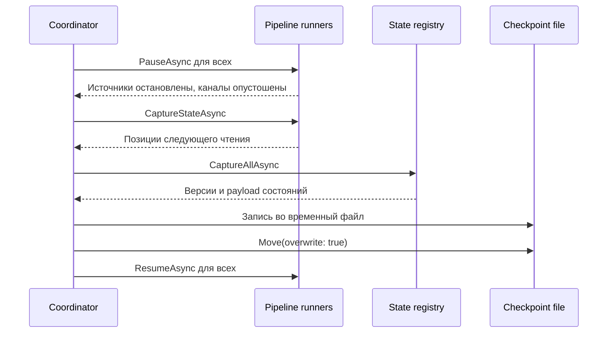

# Runtime и checkpoints

## Сборка и запуск задания

`JobsOrchestrator.TryAddJob` выполняет следующие действия:

1. создает новый `JobId`
2. вызывает `IJob.Configure` с `BasicJobBuilder`
3. проверяет завершенность всех pipeline
4. нормализует checkpoint options и путь
5. создает `BasicJobRuntime`
6. запускает runtime через `Task.Run`
7. сохраняет `JobEntry` в потокобезопасном словаре

Метод возвращает `OrchestratorStatus`, а не выбрасывает обычные ошибки конфигурации наружу. При успехе заполнены `JobId` и, если checkpoints включены, `CheckpointPath`. При ошибке `JobId == null`, а причина находится в `ErrorMessage`.

## Выполнение pipeline

На каждый pipeline runtime создает отдельный runner. Перед чтением runner вызывает `TryConnect` сначала у sink, затем у source.

Внутри runner работают две задачи:

- producer читает `IAsyncEnumerable<SourceRecord<TInput>>` и пишет записи в bounded channel
- consumer последовательно вызывает process delegate и sink

Канал имеет емкость 128, одного writer и одного reader. Режим заполнения `Wait` не позволяет неограниченно накапливать записи в памяти.

Позиция обновляется и диагностический счетчик увеличивается только после того, как:

1. processor успешно вернул результат
2. sink завершил `WriteAsync`
3. sink вернул `true`

При ошибке или отмене одной из двух задач runner отменяет связанную задачу. При ошибке любого pipeline `BasicJobRuntime` отменяет остальные pipeline того же задания и распространяет исходное исключение.

## Отмена и состояния выполнения

`JobsOrchestrator.GetJobSnapshot` вычисляет состояние попытки:

| `JobExecutionState` | Условие |
|---|---|
| `Running` | задача еще выполняется, отмена не запрошена |
| `Cancelling` | отмена запрошена, задача еще не завершена |
| `Completed` | задача успешно завершилась |
| `Cancelled` | задача завершилась отменой |
| `Failed` | задача faulted |

`TryRemoveJob` сначала удаляет запись из словаря, затем вызывает `CancelAsync` и ждет завершения задачи. Ожидаемая `OperationCanceledException` считается успешной остановкой. После удаления получить snapshot попытки уже нельзя.

Штатный финальный checkpoint при остановке не создается. Последним сохраненным остается checkpoint предыдущего тика.

## Настройка checkpoints

```csharp
builder.ConfigureCheckpoints(new CheckpointOptions
{
    Enabled = true,
    DelayMillisecond = 5_000,
    PathToCheckpoint = "checkpoints/my-job.json",
    RestoreMode = CheckpointRestoreMode.ResumeOrCreate
});
```

| Параметр | Описание |
|---|---|
| `Enabled` | Включает восстановление и периодическую запись |
| `DelayMillisecond` | Период timer; при включении должен быть не меньше 1 |
| `PathToCheckpoint` | Относительный или абсолютный путь к JSON-файлу |
| `RestoreMode` | Политика наличия существующего файла |

Относительный путь преобразуется в абсолютный относительно `AppContext.BaseDirectory`. Если путь не задан, используется:

```text
<AppContext.BaseDirectory>/checkpoints/<JobId без дефисов>.json
```

Автоматическое имя уникально для попытки, поэтому для восстановления после повторного запуска карточки нужно задать стабильный `PathToCheckpoint`.

## Режимы восстановления

| Режим | Файл существует | Файл отсутствует |
|---|---|---|
| `ResumeOrCreate` | восстановить | начать с пустых позиций и состояний |
| `ResumeOnly` | восстановить | ошибка запуска |
| `CreateNew` | ошибка запуска | начать с пустых позиций и состояний |

`ResumeOnly` требует явно заданный путь. Путь должен указывать на файл, а не на существующий каталог.

## Алгоритм согласованного снимка

При каждом тике `CheckpointCoordinator` ставит barrier для всех pipeline:



`PauseAsync` блокирует регистрацию новых записей и ждет, пока счетчик pending records станет нулевым. Поэтому snapshot состояния соответствует сохраненным позициям источников.

Возобновление pipeline находится в `finally` и выполняется даже при ошибке сохранения. Ошибка coordinator при этом завершает все задание ошибкой.

## Формат файла

Текущая версия формата — 1. Пример:

```json
{
  "version": 1,
  "createdAtUtc": "2026-09-19T12:00:00+00:00",
  "sources": {
    "input-file": {
      "offset": 42
    }
  },
  "states": {
    "received": {
      "version": 1,
      "payload": "W3siVmFsdWUiOiJleGFtcGxlIn1d"
    }
  }
}
```

`payload` — Base64-представление JSON-байтов состояния. Версии документа и каждого state snapshot проверяются при чтении. Также проверяются непустые имена, неотрицательные offsets и наличие payload.

Запись выполняется с `FileOptions.WriteThrough`:

1. создается уникальный временный файл рядом с целевым
2. сериализуется весь документ
3. поток flush-ится
4. `File.Move(..., overwrite: true)` заменяет целевой файл
5. оставшийся временный файл удаляется в `finally`

Операция защищает от частично записанного JSON, но долговечность и атомарность замены зависят от семантики файловой системы.

## Семантика обработки

Текущая реализация согласует позицию source и внутреннее состояние, но не объявляет формальную end-to-end гарантию доставки:

- Kafka producer идемпотентен в рамках своей сессии
- Kafka consumer offsets не коммитятся в Kafka
- checkpoint создается периодически, не после каждой записи
- после сбоя записи после последнего checkpoint будут прочитаны повторно
- внешний sink может увидеть дубликаты, если не обеспечивает собственную идемпотентность
- транзакции между sink и checkpoint отсутствуют

Практически обработчик и sink должны быть готовы к повторной доставке.

## Диагностика

`JobExecutionSnapshot` содержит:

| Поле | Значение |
|---|---|
| `JobId` | идентификатор попытки |
| `State` | состояние задачи |
| `ProcessedCount` | сумма успешно завершенных записей всех pipeline |
| `LastProcessedAt` | наиболее позднее время обработки |
| `LastProcessedMessage` | JSON или `ToString()` последнего входного значения |
| `States` | снимки зарегистрированных состояний |
| `ErrorMessage` | сообщение базового исключения |

Диагностическое значение ограничено 4000 символами. Для каждого состояния возвращается не более 50 элементов, но `ItemCount` содержит полный размер.

Счетчики диагностики живут только внутри попытки и после restart задания начинаются с нуля, даже если state и позиции восстановлены из checkpoint.

## Ограничения runtime

- один consumer на pipeline
- фиксированная емкость channel 128
- только одна process stage
- нет filter, branch, merge и batch
- нет retry, timeout, backoff, DLQ или circuit breaker
- состояния целиком находятся в памяти и целиком пишутся при каждом checkpoint
- финальный checkpoint при остановке отсутствует
- произвольный source не освобождается через `IDisposable` runtime-ом

Дополнительный список — в [Эксплуатация и ограничения](operations-and-limitations.md).
